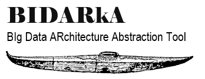

<font face="verdana, sans-serif">
<p>
BIDARkA stands for “BIg Data ARchitecture Abstraction tool.”
<br />
The idea is to abstract away the complex parts of the big data
<br />
architecture – sqoop, spark, tdch, bteq, hive.
<br />
</p>
</font>

---

<font face="verdana,arial,sans-serif" size="5.0em">
<b>
Installing local version BIDARkA
</b>
</font>
<br/>


```bash
git clone https://AD09492@bitbucket.anthem.com/scm/dsuw/bidarka-tool.git
```

<font face="verdana,arial,sans-serif" color='gray' size="2.0em">
Requirements
</font>

```bash
impyla>=0.14.1
Teradata==15.10.0.20
```

<font face="verdana,arial,sans-serif" color='gray' size="2.0em">
PIP
</font>

```bash
pip --cert /opt/cloudera/security/x509/cert.pem install --trusted-host=pypi.python.org /path/to/bidarka
```
---
<font face="verdana,arial,sans-serif" size="5.0em">
<b>
Developers
</b>
</font>


|Name|E-mail
|:---|---|
|Brian Fornelli|brian.fornelli@anthem.com   |
|Kim Yao|jinhui.yao@anthem.com|

---

<font face="verdana,arial,sans-serif" size="5.0em">
<b>
Basic API
</b>
</font>


    beeline(command, payload={})
        Run beeline command
        :param command: beeline command
        :param payload: kv pairs (rare to use this)
        :return:

    bteq(script_path, payload={})
        Runs a .bteq script
        :param script_path: path/to/bteq
        :param payload: kv pairs to template
        :return:

    csv_hive(db, table, path)
        Convert a CSV table to Hive
        :param db: destination database
        :param table: destination table
        :param path: path/to/csv
        :return:

    execute_script(script, configuration={})
        Executes a valid SQL script on teradata
        :param script: path/to/script
        :param configuration: Teradata configuration
        :return:

    fetch_fast_df(db, tbl, index_column='indx')
        [Experimental] Pulls table from teradata using TPT into a pandas dataframe very fast.
        :param db: database
        :param tbl: table
        :param index_column: indexing key
        :return: pandas dataframe of table

    fetch_hive_df(sql)
        Fetch the table using sql into a pandas dataframe using impala
        :param sql: select code
        :return:

    fetch_odbc_df(sql, configuration={})
        Fetch data from Teradata into a pandas dataframe
        :param sql: Valid SQL
        :param configuration: Configuration for teradata connection
        :return:

    hive_csv(db, table, path, orderby=None)
        Convert a Hive table to csv.gz
        :param db: database
        :param table: tablename
        :param path: destination path
        :param orderby: ordering [optinoal]
        :return:

    hive_drop(db, table)
        Safe drop of hive table
        :param db: database
        :param table: tablename
        :return:

    hive_hql(path, payload={})
        Runs a .hql script via beeline
        :param path: /path/to/hql
        :param payload: kv pair to template
        :return:

    invalidate_metadata(db, tbl)
        Invalidate the table so that impalay can be used
        :param db:
        :param tbl:
        :return:

    prompt_password()
        Prompt for the password... this should show up in IDE but if it doesn't check the running command-line
        :return:

    read_config(key=None)
        Read the config.ini file
        :param key:
        :return:

    renew_kerberos()
        Renew the kerberos ticket
        :return:

    spark(path, payload={}, configuration=None)
        Runs a spark program *.py at given path
        :param path: path/to/sparkjob.py
        :param payload: kv pairs to pass as a configuration
        :param configuration: [optional] spark configuration dictionary object
            see config.ini for an example
        :return:

    spark_csr_local(feature_path, meta_path, table_name, n, sort=False, key=None)
        Construct a localized version of the training set and bring it down to `feature_path` and metadata to `meta_path`
        so that you can do modeling work.

        Note:  This assumes that there is a primary key `mcid`.
        :param feature_path:  *npz file where features will be stored as a CSR matrix format
        :param meta_path:  *.csv file where the metadata will be stored
        :param table_name: The target table to read from in Hive (Note:  this needs to be in our LiL format)
        :param n: The number of features/variables (assume a mXn matrix)
        :param sort:  (Default False)
        :param key:  Key for sorting ignored if sorted=False
        :return: None

    sqoop(tdb, ttable, hdb, htable, payload={})
        Sqoops the teradata table tdb.ttable into hive hdb.htable
        :param tdb:  Teradata database
        :param ttable: Teradata table
        :param hdb:  Hive database
        :param htable:  Hive table
        :param payload:  payload of k:v pairs
        :return:

    tapeworm(idb, itbl, odb, otbl, primary_key, col_path)
        Converts a dense table into a sparse format in Hive
        :param idb: inbound database
        :param itbl: inbound table
        :param odb:  outbound database
        :param otbl: outbound table
        :param primary_key: primary key for the table
        :param col_path: path to a text file one line for each feature
        :return: